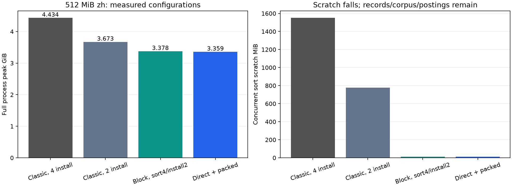

# 初始化峰值、算法改进与大语料边界

日期：2026-10-01。候选实现位于 `bpe/initial-owner-waves`，工作树 `/root/code/tokenizers-worktrees/initial-owner-waves`；最终代码 `7e794db1`。生产基点 J `376363d2` 保留。本文汇总已完成的 35 次正式调用；磁盘/流式训练仅预研，见 [EXTERNAL_MEMORY_BPE.md](EXTERNAL_MEMORY_BPE.md)。

## 1. 已完成的变化

原四 owner 的完整 radix scratch 在中文 512 MiB 下合计约 1.51 GiB，把进程峰值推到 4.43 GiB。当前候选通过低 scratch 排序、排序与安装分别调度、直接填充最终 owner streams，回到约 3.33–3.46 GiB 的已测范围。速度有主机波动，不能承诺每次无损或稳定加速。

| 改动 | 删除的工作或存储 | 已落实的范围 |
|---|---|---|
| 安装分 wave，消费后释放 records | 同时活跃 scratch、records 与最终 postings 的重叠 | 同一 owner 的权重、floor、位置顺序保持；默认最多两 owner 同时安装 |
| block摘要按wave归并 | 全体Q的频率摘要Vec同时保留 | generic block路径，保持初始化worker数并行，最终floor在全部wave之后 |
| Rust block radix / Radsort | 每 owner 的全长 `8n` scratch | 稳定按 high32 pair code 排序，low32 position/payload 原序保留；当前 flat、小初始 alphabet 分支 |
| 排序并发独立于安装 wave | 避免为了限制最终 postings 重叠而串行化排序 | 4 owner 可同时排序，随后按两 owner 安装；merge workers 未缩减 |
| count-prefix 直接 scatter 到最终 streams | 旧 chunk route 后的全量 compact 读写 | 两遍扫描、exact owner counts、互不相交写入切片；当前 radix 分支 |
| 8B candidate heap | heap backing 从 329.29 MiB 降到 164.64 MiB | 普通配置、完整 ID 域 ≤65,536、初始加权边质量 ≤u32::MAX；否则16B fallback |
| 分块 posting 长度 + 稀疏权重修正 | generic block 初始化的重复频率表 | u32 local offset + 64 位 base、完整 pair key/频率；与 flat 优化独立 |

8B heap 属于条件优化，按照用户的大规模目标后排。通用分块、有界初始化和生命周期回收优先。arena 阈值留待算法路线确定后再选，本轮没有给数十 GiB 宣布一个最佳阈值。

## 2. 先限制安装并发，空间与时间如何变化

固定中文 512 MiB、none、目标词表50k、min2、AtomicU32、初始化/merge各4workers。以下三次同 binary，全部初始与出生 posting 使用 full Bump；每配置一次。

| 同时安装 owner 数 | 初始化 s | 完整 train s | 全程峰值 GiB | 活跃 radix scratch MiB |
|---:|---:|---:|---:|---:|
| 4 | 6.880 | 19.869 | 4.434 | 1,550.52 |
| 2 | 6.778 | 19.468 | 3.673 | 777.99 |
| 1 | 10.455 | 24.184 | 3.597 | 396.01 |

两 owner 是这一初版的候选折中。sort/group/install 的直接区间从4 owner的约3.58s变成2 owner的约4.09s，实际慢约14%；未改 route 更快抵消了它。完整 train 的一次结果不能证明限制并发没有速度损失。1 owner 的时间代价明确，因此没有继续单线程化安装。

## 3. Radsort 保留并行，降低每个排序任务的 scratch

独立代理比较 classic radix、C Radsort、Rust Radsort、hash和rank原型，并核对真实权重与位置。详细结果见 [算法研究](INITIALIZATION_ALGORITHM_RESEARCH.md)、[Rust原型与原始日志](results/initialization-algorithms/README.md) 和 [独立安全/稳定性审查](results/initialization-algorithms/RADSORT_INDEPENDENT_REVIEW.md)。这些 kernel 数字没有当成 Trainer 收益。

固定 block size `B=512`，每 owner heap scratch 为：

```text
2 MiB + 9·(floor(n/512)+512) bytes
```

另计栈与allocator，debug validator 还会额外分配。固定 B 的目录仍随 n 线性增长，不能称本实现的全部 scratch 为 O(√n) 或常数。小输入在 `8n` scratch 更小时回到 classic scatter。Rust 实现捕获单一 input/scratch raw base，保持排列双射、严格有序 partial blocks 和总长度不变量；compact 用允许重叠的 copy，并在覆盖未读块前迁移它。BSD-2-Clause 完整许可随源文件和 vendored 原型保留。[原论文](https://arxiv.org/abs/2607.05302)、[上游实现](https://github.com/clausecker/radsort/tree/f69e816c3cd79d312cd67aea5b9cf1c338c1b371)。

第一轮同 binary 的 classic安装2 / block安装4 / block安装2，峰值分别3.672 / 3.805 / 3.560 GiB：低 scratch 解决了排序副本，records与postings的安装重叠仍在。于是将4 owner排序与2 owner安装分开。

| 分阶段同 binary 配置 | 初始化 s | train s | 全程峰值 GiB | sort scratch MiB |
|---|---:|---:|---:|---:|
| classic sort2 / install2 / ALL | 7.820 | 21.127 | 3.680 | 777.99 |
| block sort4 / install2 / ALL | 6.023 | 20.021 | 3.552 | 11.42 |
| block sort4 / install2 / T256 | 5.507 | 20.003 | 3.378 | 11.42 |
| block sort4 / install2 / STD | 5.447 | 23.065 | 3.379 | 11.42 |

每项一次。较低初始化峰值使历史 full arena 的余量减少，不能继续沿用旧4.43GiB峰值作为预算。

## 4. 直接 route 与条件 heap 压缩

同 binary、block sort4/install2，保留相同语料、模型和物理工作量。直接 route 删除约 `16E_u` 的 compact 读写请求；本例约3.03GiB。每 chunk/owner 先数 exact 长度，prefix分割最终streams，再把可写切片分给Rayon jobs。线程全部join后才发布已初始化Vec；无需共享可写 raw pointer。

| 同 binary 配置 | 初始化 s | train s | 全程峰值 GiB |
|---|---:|---:|---:|
| 旧 route / wide heap / T256 | 5.741 | 19.730 | 3.368 |
| direct route / wide heap / T256 | 4.357 | 17.893 | 3.377 |
| direct route / packed heap / T256 | 4.328 | 18.105 | 3.359 |
| direct route / packed heap / ALL | 3.923 | 16.470 | 3.439 |
| direct / packed / ALL，追加反序 | 4.892 | 20.067 | 3.458 |
| direct / packed / T256，追加反序 | 4.974 | 20.954 | 3.333 |

direct route 的初次完整调用与直接区间同向改善。packed heap 的 backing 精确减半，单次 train 略慢，不能给它宣布速度收益。追加一对源于T256/ALL的资源选择疑问；两配置各n=2，主机耗时波动较大。ALL两次更快，但一次超过历史B2约3.44GiB预算；按用户后续指令将阈值选择延后。

packed排序键是 `(freq32<<32) | !pair32`，与原“频率大优先，同频canonical pair小优先”完全一致。普通合并只删除加权边界，所有历史pair频率≤初始加权总边质量；entry频率仍u64。非空affix存在旧pair增频反例，入口和压缩证书显式拒绝该分支。高权重和大ID使用wide，防御性push超界会升级heap；不能用原HF的i32溢出行为测试大权重兼容。



图中比较的是已测配置，前两柱ALL、后两柱T256；没有把跨binary/allocator的差额全归于一个算法。

独立 finalize 成本探针显示四owner compact CPU总和492.5ms，最大单owner134.76ms；该次完整train21.280s。当前并行条件下仅约0.63%的理想墙钟机会，因此暂不重写consumer为逻辑块迭代器。全量records有界化更符合数十GiB目标。

## 5. 通用 block 路径的实际收获与限制

超过 flat32 的位置继续用 **u32局部posting + 64位base**，owner登记block IDs；当前并没有把所有posting升级为u64。新稀疏计数在这条generic路径实现：

```text
uniform weight w: frequency(q)=posting(q).len·w
mixed weights:   frequency(q)=posting(q).len+Σ_valid_edges_of_q(w−1)
```

uniform不建频率表；mixed只为非单位权重边更新signed delta表。所有物理position都保留，包括zero weight；local freq=0的block摘要也必须输出，同pair可能从其他block通过global floor。先全局精确汇总再筛floor。既有i64初始mass检查加block长度界支撑signed运算，仍保留checked_add与非负转换；频率没有收窄成u32。

正式proxy使用STD allocator、同binary legacy/sparse，对16MiB输入强制2²⁰槽block共8次。模型与归档基线一致，但哈希词序使block key数Q稍变，初始化时间有快有慢。为消除该变量，另建诊断binary，按片段文本字典序固定corpus；32MiB输入、2²⁴槽block、仍实际u32 local offsets，再对照8次。词序排序仅属于诊断，不进入候选源码。

| 固定词序32MiB | blocks | 非单位边占比 | 临时频率表容量和 MiB，legacy→sparse | 初始化 s | train s | 全程峰值 MiB |
|---|---:|---:|---:|---:|---:|---:|
| en none | 2 | 0.244% | 1.063→0.066 | 1.012→0.826 | 8.475→8.472 | 603.03→595.43 |
| zh none | 1 | 0.236% | 34.000→0.266 | 2.416→2.045 | 6.563→5.947 | 366.77→368.95 |
| en whitespace | 1 | 32.856% | 0.531→0.133 | 0.398→0.382 | 2.130→2.064 | 115.91→116.52 |
| zh whitespace | 1 | 1.885% | 34.000→1.063 | 2.070→2.147 | 5.721→6.323 | 359.55→362.46 |

表容量是所有block的估算和，不等同同时活跃内存或进程峰值。两个proxy的zh whitespace均没有支持速度收益；其余方向也只n=1。保留稀疏版本作为已核验的容量候选，**未证明通用最快，未迁入生产J**。全部边非单位且权重不uniform时，exception map可能与旧表等大，还增加每block-key恢复查询，不能承诺最坏输入加速。后续可由真实权重分布选择计数方式；目前不加入无证据阈值。

### 5.1 已继续实现：逐wave消费block摘要

`7e794db1` 将generic路径的全体block summary collect改为每波最多初始化worker数的block。每波完成扫描和owner归并后立即释放摘要Vec；owner频率和目录继续累加，所有波结束才筛floor并建heap。每个owner看到的block ID顺序与原来一致，AA仍在merge路径沿全局位置处理。该改动不依赖小ID/32位频率证书。

同binary、STD allocator、固定lexical词序、zh32MiB none、u32 local offsets、2²⁰槽block、4init/4merge。实际13blocks，each n=1：

| 摘要策略 | waves | 摘要Vec峰值 MiB | 初始化 s | train s | 全程峰值 MiB |
|---|---:|---:|---:|---:|---:|
| 全部collect | 1 | 48.001 | 0.704 | 4.266 | 479.94 |
| 每波最多4块 | 4 | 16.000 | 0.790 | 4.289 | 431.57 |

模型、global floor、物理边、非unit边、Q和最终工作量一致。摘要Vec峰值减约2/3，进程峰值少48.38MiB（约10.1%）；初始化多12.17%，完整train多0.55%。保留为减少大规模临时存储的候选，不承诺无速度损失。owner ledger提前存在，会与后续block扫描重叠；数据量/分布变化仍可能改变RSS收益。

其额外摘要容量由一个wave的Q决定，而不是全部Q；当blocks≤init workers时只有一wave，没有这个容量收益。一个address block依然可很大，因此这一步不是按固定RAM字节预算的完整bounded初始化。前述两遍full-key/batch方案仍待设计验证。新增跨3waves、AA和混合/零权重的oracle纳入57项完整库测试。

## 6. 数十GiB需要继续解决什么

[扩容分析](SCALE_UP_ANALYSIS.md) 给出明确边界与容量算术。保持本例唯一片段密度，32GiB raw对应约13.19B槽，单u32 corpus约49.14GiB，初始u32物理位置逻辑展开约48.45GiB；另有去重字符串、目录、候选与增长容量。新flat排序不直接用于该情景；当前fallback没有分配假想的96.91GiB全量radix records。

当前候选降低了本机初始化峰值，尚未让整个Trainer成为小内存外存算法。通用后续顺序：

1. 已按wave消费summary；继续将scan batch与额外records限制到明确字节预算，global floor仍须等精确全局汇总。
2. full u64 pair key和local offset的有界排序/初始化；scan batch与address block分别定义，核对跨batch posting汇总。
3. posting长度/容量仍u32。单个热pair接近2³²项时，几何扩容可能先触碰容量界；选择较小address blocks、精确预留或分段posting，不能只靠64位base解决。
4. 可回收posting池和冷热posting压缩，计入生命周期、size-class rounding与解码scratch；随后再决定arena策略。
5. 磁盘/流式精确训练另需去重、语料随机改写、全局候选与posting外存设计，不能把mmap当成已兑现的RAM边界。

算法地图覆盖全路径与前沿实践，见 [ALGORITHM_FRONTIER_MAP.md](ALGORITHM_FRONTIER_MAP.md)。大规模条件算术没有外推训练秒数；原始字节数、去重物理位置与加权频率分开。

## 7. 核验与复现

最终功能源码 `7e794db1` 的57项lib测试全部通过；此前 `f16dee08`只修正文档引用。包括原逐轮HF随机差分、independent greedy oracle，新增stable low32任意payload、边界block、owner widths、Atomic/nonAtomic、global floor、0/1/7混合权重、均匀0/2、高于u32的频率、大ID与affix fallback。独立Radsort审查单列。首次大权重测试误用HF i32 oracle的失败日志保留，改为既有wide serial oracle后通过。

[归档摘要](results/initialization-summary/bundle.summary.json) 验证35次正式调用的9组输入/模型签名、同binary组全部源码hash一致、实际binary/hash、posting visits与剪枝量、库存物理位置、heap精确容量、process swap=0和MemAvailable>1GiB。固定词序proxy另核对block数、物理边、非unit边与Q完全一致。失败smoke保留原stdout/stderr，不计为正式成功调用。

每组results目录保存control、environment、JSONL、stdout、stderr、summary、build.log与相对该组source commit的完整 `instrumentation.patch`；八份patch在临时git index中对各自基点 `git apply --cached --check` 通过。总候选补丁：[candidate-source.patch](results/initialization-summary/candidate-source.patch)。测试日志在同目录，full源码还在独立候选分支。图有PNG/SVG；可执行：

```bash
python3 analyze_initialization.py
uv run --no-project --with matplotlib python analyze_initialization.py --plot
```

聚合不重新训练。各 `run_block_summary_waves.py`、`run_initial_owner_waves.py`、`run_block_radix*.py`、`run_frontier*.py`、`run_block_count*.py` 保留本机benchmark调用；smoke与正式结果分开。本次未写原efficient_bpe项目，生产J不叠加未测的大规模外存接口。


## 8. 现代算法哪些已用，哪些实验无收获

| 路线 | 实验层级与结论 |
|---|---|
| Radsort稳定块复用 | C/Rust原型与完整Trainer已测并接入；主要明确收获是低scratch，配合directroute/安装wave降低完整峰值 |
| count-prefix/directscatter | 完整Trainer已测并接入；同binary route对照完整train19.730→17.893s，n=1 |
| 两遍hash直接posting | 已做真实1/4/16MiB独立索引原型；16MiB320.6→1116.6ms，约3.48倍耗时，空间更小；未接入Trainer |
| bitmap+rank三遍posting | 同上；16MiB1083.6ms，约classicradix3.38倍，空间更小；未接入Trainer |
| 更小owner安装并发 | 已测4/2/1；1owner完整24.184s，2owner19.468s，低一点峰值换明显慢；未选1owner |
| Radsort逻辑块consumer省finalize | 只做实际成本探针，未重写；最大owner134.76ms/全训21.280s的理想机会约0.63%，降优先级 |
| packed8B heap | 已接入条件分支、容量精确减半；一次直接对照train17.893→18.105s，未体现速度收益，不据小差异宣布稳定负收益 |
| generic sparse delta与summarywaves | 已接入通用候选；容量/summary/RSS有收获，速度分布混合和wave屏障代价单列 |
| SimdQuickHeap、TPHT、ZombieHash | 尚未做本Trainer性能实验；当前select机会小、Entry宽度/生命周期不符或churn成本未隔离。保持调研候选，不能称负收益 |
| PARADIS、GoParallel/其它排序与冷热混合 | 尚未整合实验；需先保持stablepayload、宽key/位置与并发内存证书；论文headline不当作本项目收益 |
| StreamVByte/Elias–Fano冷posting、可回收pool、full-key boundedbatch | 尚未实现；属于后续通用存储/初始化候选，需要真实访问与生命周期gate |
| 外存PQ/图系统/压缩域RePair | 按用户要求仅预研，与当前内存内算法工作分开推进 |

SwissTable/AHashMap、按预分词片段加权去重已在基线采用；本轮没有把它们记为新的论文收获。35次正式调用均已结束，目前没有训练计时正在运行。全部原型正确性、负收益和未测状态均保留，避免只报告成功方案。
