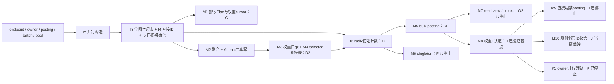

# BPE 优化清单与组合关系

## 目标与选型方式

最终目标是在同一原Trainer接口、语料和参数下选择**稳定的最快端到端组合**。主指标是feed到train_vocab返回的elapsed，以及其中完整train；模块计时用于解释组合为什么变快或变慢。已失败版本的前后比较只保留作诊断，胜出组合必须优于当前最快有效组合。

当前选择J `376363d2`（H+规则邻居目录聚合）。原48tests/静态审查通过，一次H→J关键对照prepare8.400→7.723秒（-8.1%），train27.790→24.613秒（-11.4%），elapsed31.762→28.701秒；初始化也快2.011秒，不能把全量差额归因J。新增scratch capacity汇总峰约2.01MiB，RSS约4.43GiB，模型与corpus/posting容量不变。n=1筛选支持当前选择，不保证稳定复现，见[J对照](results/optimization-rule-aggregate.summary.md)。

H `00216d91`是保存的已验证基点：两个交错pair初始group/prepare及全训均改善，train中位32.397→25.577秒，位图增加约98KiB。用户认为改善明显，取消第三对。F/G2/I停止；K的两对清理改善未兑现完整收益，停止，不叠加到J。见[H对照](results/optimization-weight-stability.summary.md)、[K两对](results/optimization-owner-parallel-drop.aggregate-n2.md)；DE之前的九次组合选型保留在[DE比较](results/optimization-radix-combination-stability.summary.md)。

兼容优化组合仍须实测：CPU缓存、带宽、分配与任务调度共享，使各项收益不能直接相加。表中“可叠加”表示算法与表示可以共存，“依赖”表示须一起落实协议，“替代”表示同一操作选择不同策略。

## 全部已实现与在推进的优化

| ID | 优化点 | 热点/模块 | 状态与来源 | 组合关系 |
|---|---|---|---|---|
| S1 | 稳定u32位置、token端点编码，合并不移整个词 | corpus/merge | 各endpoint分支已有 | 后续P/I/M优化的共同基础；WordArena词压缩是替代表示 |
| S2 | 打包u64 pair键；16字节候选、8叉堆 | owner/选择 | 已有 | 与语料构造、批次和计数策略可叠加 |
| S3 | 16字节SmallPosting，内联2个u32或4个u16局部位置 | posting分配 | 已有 | 所有endpoint策略共用；posting宽度改变内联容量 |
| S4 | 唯一pair owner与posting所有权 | pair频率/提交 | 已有 | 并行计数、批次与出生安装的共同前提 |
| S5 | 普通字符旧pair单调，低频永久退役；新pair全批聚合后剪枝 | 频率/候选/posting | 已证并实现 | 与有限长度兼容；非空affix须其它证书或generic fallback |
| P1 | 一次创建持久Rayon池，协调器在merge池内 | 调度 | 已有 | 与所有并行内核共用；初始化与merge线程不同才另建池 |
| P2 | 具体规则的精确批次证书；预留ID/AA独立批次 | greedy规则选择 | 已有 | 允许安全并行写；不能跳过canonical tie/身份条件 |
| P3 | 每worker一份route，8字节共享出生链，聚合后直接预留posting | delta/commit | 已有 | M2/M3继续使用；逐小任务独立map已淘汰 |
| P4 | AA摘要与奇偶传播，跨块保持左到右选择 | AA规划 | 已有 | 原Plan与融合组合均共用AA fallback |
| I1 | 空间路由位置→owner并行哈希计数/建堆 | 初始化pair计数 | 原并行版已有 | 与I2–I5可叠加；I6是其计数阶段的替代方案 |
| I2 | 连续词区间规划、并行独占填充最终corpus | 语料构造 | A `98ca7fc1`，继承到C/B2 | I3–I5依赖最终区域与冻结ID；A本身不是另一个可重复叠加的收益 |
| I3 | None alphabet每worker字符存在位图，Some沿用HF频率裁剪 | alphabet | C `fbdc0b2b` | 与I2/I4/I5兼容，ID集合/顺序保持一致 |
| I4 | Unicode→canonical ID直接表，省逐字符UTF-8字符串hash | decode/fill | C，表4.25MiB、构造后释放 | 不要求I3；固定ID后可独立使用，与I5兼容 |
| I5 | MaybeUninit最终数组由worker直接写，完整join后转换 | 最终分配/first-touch | C | 依赖I2覆盖证明；与I3/I4及所有merge策略兼容 |
| M1 | 空间有序Plan下同词复用权重cursor；近邻8项后远跳二分 | delta权重 | 原并行版/C | 与排序Plan局部性匹配；M2改变访问顺序后不能直接期待同样收益 |
| M2 | flat非AA过滤/delta一遍融合，无全局16字节Plan排序 | merge prepare | B首版失败；B2保留融合但修正查询 | 依赖P2证书、共享Atomic端点写与出生顺序；M3/M4使组合有效 |
| M3 | 每256位置一个pivot目录，桶内权重精确查询 | 稀疏weight查询 | B2 `a0832c48`，3.07MiB | 与M2可叠加；可复用到I6；也可适配M1远跳，但该组合未测 |
| M4 | selected head/tail按ID直接表，重复符号小hash回退 | 同批最终邻居查询 | B2 | 与M2耦合；原有序Plan可直接看相邻Plan，无需叠加此表 |
| I6 | 初始pair/位置按owner稳定radix排序，连续分组频率，精确预留posting；低频先过滤再建map | 初始count及posting分配 | D `d15c18cc`，45tests/复核通过；三对D/B2 train比中位1.0002，独立D收益不稳定，DE组合已胜出 | 替代I1的逐位置哈希计数；复用I2–I5和M3，与C或B2 merge理论兼容 |
| M5 | 预留posting批量逆序直填，省push检查与后续reverse | owner commit；组合D时也影响初始posting install | E `35eaf03c`，DE `c8702374` 测试/审查/计时完成，继承到H/J；E单独无明确收益 | 与I6正交；共同SmallPosting接口，组合仍须端到端测量 |
| M6 | singleton birth直接放group，第二次才物化node | prepare/delta及commit | F `4a2f148a`：46tests与审查通过；两个直接模块screen变慢，停止；DEF `7504cbfd`仅留源码 | 与M5兼容但无收益证据，不纳入推荐 |
| M7 | join后的只读非原子corpus视图，128项连续端点比较 | prepare | G1 `cbb935b2` / G2 `2f238505`：47/48tests与审查通过；G2确有自动SIMD，但三对prepare/elapsed比中位1.0195/1.0018，停止 | 从DE派生；与查询独立，块化替代原过滤循环 |
| M8 | 每256位置认证全权重1，位图命中直接返回1 | 初始group与prepare权重查询 | H `00216d91` 从DE派生；47tests/审查通过；screen及两个pair改善，继承到J | 与I6/M2/M3/M5兼容；混合桶保留精确目录查询，额外约100KiB |
| M9 | 聚合来源组后直接组装posting，最后一次owner安装 | flat owner commit | I `e3a1954c` 从H派生；48tests/审查通过，screen commit+15.2%，停止 | 与M8兼容；临时16B/来源组，减少逐组ledger hash查找 |
| M10 | Task内左右neighbor ID目录累计，按组flush到route | flat非AA prepare | J `376363d2` 从H派生；48tests/审查通过，一次prepare-8.1%/train-11.4%，当前选择 | 与M8/M5兼容；目录域上界65,536，超出走原路径 |
| P5 | 结果构造后既有pool并行销毁各owner | cleanup | K `288ad858` 从H派生；47tests通过，两对清理平均-32.1%但全训未胜出，停止 | 与M10理论兼容，未组合，不纳入J |

AtomicU32是M2共享引用写入的实现条件，本轮不再当作一个独立速度优化点重复计时。u32与AtomicU32槽位大小相同已核对。原Plan使用split_at_mut独占区间；融合使用prepare join→独立Atomic writes join→commit的屏障，两种调度策略互为替代。

## 尚未融合、待实现或只具理论证书的点

| 优化点 | 适用范围/关系 | 状态与优先级 |
|---|---|---|
| owner commit减少临时born map/二次hash，复用route/group结构 | 与I6及C/B2初始化兼容；须保留全worker阈值聚合和posting有序 | commit约6–8秒。bulk已在DE验证并保留；singleton延迟节点方案F没有直接模块改善，停止。后续须从实际hash/group访问成本选择新候选。 |
| route/node/有效起点容量复用 | 可与M2/M3/M4共存；保留容量可能抬高常驻RSS | 待profiling确认实际分配热点，不先造框架 |
| M1远跳使用M3目录 | C排序Plan查询策略的局部替换 | 尚未实现/测量；若B2端到端胜出暂不展开旧路径新组合 |
| u16 corpus完整ID域证明 | 与u32 posting地址独立，限制完整可能ID域及separator | 已有原型和测试；当前公平工作集固定u32，不重开宽度矩阵 |
| posting u16局部偏移/多块字典 | 替代flat32目录，可能减少payload但增加字典访问 | 已实现/边界测试，尚无当前组合的大语料收益证据 |
| Halfword：初始u16 code、合并复用旧槽保存完整u32 ID | 替代S1语料表示；并行bitmap RMW/跨度覆盖需另证 | 已有外部串行原型，尚未迁入HF；不能与端点布局字节收益相加 |
| H2.5/H3、u8初始码+短序列映射 | 替代语料表示，收益/访问成本不同；别名跨度有约束 | 原型或推导，未迁入当前并行组合，暂后排 |
| affix可逆/单调证书通过后进入compact；局部输出角色剪枝 | 配置条件优化，可与其它compact项共存；不满足条件保持generic | 证明在AFFIX_PRUNING.md，未实现；当前none工作集不受益 |
| 有限max_length旧边提前过滤、无出生内核、规则级NONE屏障 | 配置条件优化，需保留初始pair例外；generic不能照搬 | 证明在LENGTH_PRUNING.md，未实现；当前无限长度工作集不受益 |
| 有限max_length的u8/u16跨度表 | 长度表示的条件替代，不改变corpus ID宽度 | 理论证书已有；长度表当前远小于posting，优先级低 |
| PR WordArena/整词压缩的短piece几何路由 | 与端点表示互斥的分片策略，不能同时保存两种完整核心 | 旧fused分支已测英文回退，不作为当前组合方向 |
| 动态posting任务抢占 | 替代连续任务划分；须恢复输出序号或出生排序 | 未实现；会改变M2有序生产者证明，先不做 |

[MEMORY_LAYOUT.md](MEMORY_LAYOUT.md)保存空间口径，[AFFIX_PRUNING.md](AFFIX_PRUNING.md)、[LENGTH_PRUNING.md](LENGTH_PRUNING.md)保存条件证书。未实现项不计入当前性能收益。

## 当前组合图

I6分支实现已从B2 `a0832c48` 派生，提交 `d15c18cc`，初始pair key可用两个u16 canonical ID编码且flat位置可用u32时启用；其余配置沿用旧计数。入口仍公开原Trainer接口、u32 corpus和u32 posting，不把内部临时pair code误写成语料ID宽度改变。

新route记录8字节/pair，radix scratch也8字节/pair，较旧4字节位置路由增加临时内存。先按当前203,230,114初始边核算：两份精确record约3.03GiB，另有corpus、输入与metadata；按实际MemAvailable≤1GiB停止。owner路由逐块精确预留，合并旧路由时及时释放原缓冲，sort scratch在posting分配前释放。记录临时峰值及最终posting/owner容量，收益必须包含route/sort/group/安装整段初始化和端到端，不能只挑hash被省掉的部分。

## 推进队列与完成标准

1. **完成C/B2选型**：三对完整运行均为B2更快；B首版失败原因保留。
2. **完成B2/D/DE选型**：九次交错运行与完整模型gate通过，当前推荐DE。E对install/commit的直接影响单列，不把未改阶段波动归因E。
3. **完成F及G筛选**：F直接模块回退；G2确认自动SIMD但prepare/端到端三对无稳定改善，停止两方向。
4. **完成H选型**：32MiB DE perf的WeightLookup top-IP样本占8.16%，同时参与初始化group和prepare；DE/H screen及两个pair直接group/prepare及全训均改善，选择H；按用户要求停止追加复测。不给未实现候选列性能收益。
5. **完成详细H诊断与J/K筛选**：debug binary与实际地址核验，独立phase/count定位；K直接清理改善但两对全训未胜出，停止。J通过48tests/审查，一次prepare与全训同向改善，当前选择；不把未改init的变动归因J。

## 当前具体组合与收益证据

| 组合 | 组成差异 | 当前证据 |
|---|---|---|
| B2 `a0832c48` | 基础优化+I2–I5+M2–M4 | C/B2三对胜出；后来B2/D/DE比较train中位35.952s |
| D `d15c18cc` | B2把I1替换为I6 | 与B2三对train比中位1.0002，方向不稳定；RSS约4.43GiB |
| E `35eaf03c` | B2+M5，只用于commit | 45tests/审查通过；单次37.082s，没有确认独立收益 |
| DE `c8702374` | D+M5，用于install及commit | 46tests/审查通过；九次比较中train31.332s、elapsed35.493s中位，推荐组合 |
| F `4a2f148a` | D+M6 | D/F一次：prepare11.472→12.062、commit6.362→6.543s；停止 |
| DEF `7504cbfd` | DE+M6 | 留存源码，未构建/测量，F回退后停止 |
| G1 `cbb935b2` | DE+只读阶段视图 | 全47tests；一次prepare11.881s，无独立稳定证据 |
| G2 `2f238505` | G1+128项端点缓冲比较 | 全48tests；三对prepare比中位1.0195、elapsed1.0018，无稳定改善，停止 |
| H `00216d91` | DE+M8全权重1认证 | 全47tests/审查通过；两个pair train中位25.577s，选择H |
| I `e3a1954c` | H+M9 | 48tests/审查通过；一次commit+15.2%、全训+9.0%，停止 |
| J `376363d2` | H+M10 | 48tests/审查通过；一次prepare8.400→7.723s、train27.790→24.613s，当前选择；n=1非稳定性保证 |
| K `288ad858` | H+P5 | 47tests通过；两对清理平均少1.280s，全train/elapsed未胜出，停止 |

每个阶段的计时包括该阶段新增的工作和内存释放。fused_prepare包含在delta内，两项不能相加；initial与merge的WeightLookup是同一分配，两项bytes不能相加。模块未改并不保证每次进程模块耗时相同：默认AHash随机seed改变物理词顺序及hash布局，现有比较保持原API但没有固定内部物理快照。

D/E可以共存，DE是实际选出的组合；F/G与其它策略的兼容性不能代替收益证据。perf样本用于挑候选，墙钟收益仍以完整对照决定。详见 [自动向量化检查](AUTO_VECTORIZATION.md)、[DE热点采样](results/optimization-de-hot-profile.md)。
