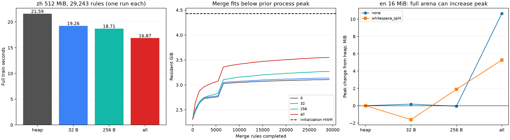
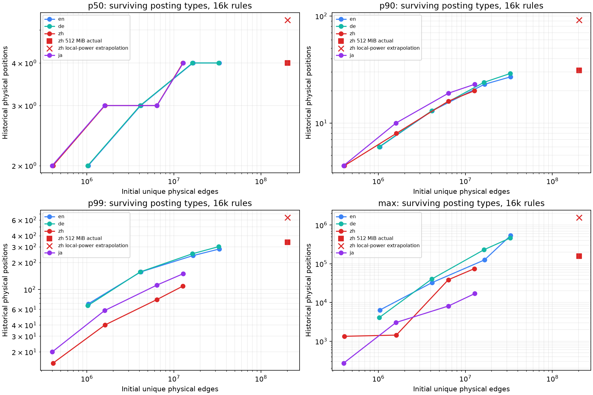

# Posting arena：按全程峰值选择阈值

## 结论

**512 MiB 中文 none 的当前最佳候选是全量 Bump。** 在同一诊断 binary、同一输入与实际 29,243 条规则下，阈值 0→32 B→256 B→all 的完整训练耗时为 21.593→19.255→18.706→16.865 秒。all 相对标准分配少 21.90%，内核记录的全程 RSS 峰值没有增加。初始化留下约 4.43 GiB 的 HWM；all 合并结束时 RSS 约 3.55 GiB，尚有约 903 MiB 余量。因此这组确实可以把中途退休的所有 posting 保留到最后。

**“预算内最大阈值”是合适的候选策略；实际时间没有必然单调性。** 英文 16 MiB none 的 all 提高峰值约 10.65 MiB；256 B 没有明显增峰、train 少 3.19%。英文 whitespace_split 则没有测到 arena 的完整训练收益。每个配置仅一次，这些数值用于候选与可行性判断，不是稳定性能排名，也没有定位连续阈值空间中的精确最优点。

多语言、规模和 merge 数分析完成 43 次生命周期诊断；可以用局部幂律描述窄区间趋势，但不能由 `raw bytes^γ` 得到可靠的通用 cutoff。应把去重后物理边数、累计分配/退休容量与阶段余量放入资源模型。详见 [独立理论](POSTING_THRESHOLD_THEORY.md) 和 [多语言实测与拟合](POSTING_THRESHOLD_EMPIRICAL.md)。生产 J `376363d2` 未修改。

## 1. 同 binary 阈值实测

所有实验使用 u32 corpus/flat32 posting、AtomicU32、init4/merge4、min frequency 2。阈值按 heap **capacity 字节**判断：≤T 用每训练 worker 一个 TLS Bump，其余沿用系统 allocator 正常释放。长度≤2 的 inline posting 不需要 heap allocation。T=0 是同 binary 的系统分配对照。

12 次完整计时顺序为：中文 0/32/256/all；英文 none 0/all；英文 whitespace 0/all；观察到英文 all 增峰后，补测英文 none 32/256、英文 whitespace 32/256。期间没有构建、测试、统计拟合或其它 agent CPU 作业。三个 1 MiB allocator smoke 已在这些计时前完成。

### 中文 512 MiB，none，目标词表 50k

| cutoff | init s | merge s | full train s | feed+train s | HWM MiB | arena 分配覆盖 |
|---|---:|---:|---:|---:|---:|---:|
| 0（heap） | 5.501 | 12.295 | 21.593 | 25.790 | 4,538.984 | 0% |
| 32 B | 4.900 | 12.523 | 19.255 | 23.388 | 4,539.469 | 64.03% |
| 256 B | 5.200 | 12.802 | 18.706 | 22.552 | 4,538.805 | 93.97% |
| all | 4.888 | 11.584 | 16.865 | 20.739 | 4,538.602 | 100% |

HWM 在四个配置的初始化返回时已建立，之后每个检查点均未刷新。32 B 的全程 HWM 比对照多 496 KiB；all 少 392 KiB。这里的“不增峰”指这组实测 all，没有给其它输入提供严格的逐字节保证。MiB=2²⁰ B，GiB=2³⁰ B。报告 HWM 取 `getrusage.ru_maxrss` 与阶段 `/proc/self/status VmHWM` 的较大值；外部轮询 VmRSS 另存于 raw JSON，未混作内核 HWM。

all 累计请求 9,323,712 个 backing buffers、1,403,805,436 B，终点 live 809,100,424 B，退休 retained 594,705,012 B。实际 51 chunks/backing capacity 1,996,817,216 B，含 metadata 1,996,819,664 B；最终统一释放 66.228 ms。chunk capacity、requested payload 和 RSS 是三个不同量。

从 `train−init−merge` 再扣独立 inventory 扫描，剩余收尾区间约为 3.607→1.640→0.509→0.204 秒。它包含结果构造、正常 Drop、arena release、统计等，不能全部称为 allocator free 时间。all 的 init、merge 也更快；32/256 的 merge 比对照稍慢，没有把全训差额全部归因于某个子阶段。



### 英文 16 MiB，固定实际 16k rules

| PT | cutoff | full train s | 相对 heap | HWM MiB | 峰值增量 MiB |
|---|---|---:|---:|---:|---:|
| none | 0 | 1.979943 | — | 342.461 | — |
| none | 32 B | 2.086253 | +5.37% | 342.645 | +0.184 |
| none | 256 B | 1.916776 | −3.19% | 342.402 | −0.059 |
| none | all | 1.820320 | −8.06% | 353.113 | +10.652 |
| whitespace | 0 | 0.484209 | — | 77.027 | — |
| whitespace | 32 B | 0.510656 | +5.46% | 75.418 | −1.609 |
| whitespace | 256 B | 0.543079 | +12.16% | 78.914 | +1.887 |
| whitespace | all | 0.487732 | +0.73% | 82.305 | +5.277 |

none 的 all 在 merge 后半段超过原初始化峰值；whitespace 的 heap 对照本来就是 merge 建立峰值。它们没有中文大样本相同的阶段余量。按当前测过的网格，none 的 256 B 是满足原峰值量级且 train 有改善的候选；whitespace 保留 heap。没有将一次 subsecond 时间差当成稳定回退，也没有把 256 B 定成所有英文输入的默认值。

## 2. 阈值应该怎样随 N、M 变化

用去重后的不同片段定义物理量，片段 i 长度为 Lᵢ、重复权重为 wᵢ：

```text
N_u = Σ Lᵢ                 E_u = Σ max(Lᵢ−1, 0)
N_w = Σ wᵢLᵢ               E_w = Σ wᵢmax(Lᵢ−1, 0)
```

容量首先受 E_u 影响；weighted frequency 用于选择规则，权重通过规则顺序、floor 和物理 rewrite 进度影响后来出生的 posting。相同 raw bytes、目标词表或 weighted N 不代表相同物理工作集。预分词还改变 unique 片段长度、边界数量及去重比例：16 MiB whitespace 输入的 E_u/E_w 为英文 17.32%、中文 88.02%。完整 unique/weighted 片段长度、权重与初始 posting 统计已保存于 [静态 JSON](posting-threshold-static.json)。

对于当前 J flat32 一次出生、一次精确预留、没有 growth 的路径，若 S(M) 是成功物理 rewrite 次数：

```text
P_birth(M) ≤ E_u + 2S(M) ≤ 3E_u
累计 heap requested bytes ≤ 16E_u
```

43 个诊断全部验证这些不变量。它提供保守 payload 预算，不能直接替代整次 RSS。终点分布随 M 改变：更大的 M 会选走大 pair，也会产生新小 pair。1 MiB 英文 none 的 p50 从 4k rules 的 4 降到 16k 的 2；16 MiB 则从 5 降到 4。

36 组拟合、6 组 32 MiB 留出、1 组 512 MiB 留出覆盖 en/zh/de/ja none 和 en/zh whitespace。固定实际 16k rules、none 的局部 E_u 幂指数，p50 为 0.146–0.250，p90 为 0.485–0.562；这些只是三点局部斜率。32 MiB 的 p50/p90/p99 留出 MAPE 为 19.4%/22.0%/17.1%，比按规模线性放大好。512 MiB 中文 p90 预测 91.84、实际 31；max 预测 1,567,308、实际 158,054。该留出也改变了源抽样范围，不能把失配只归因于规模。

跨语言留一预测中，none/16k 的 p90 MAPE 用 raw bytes 为 24.5%、用 E_u 为 8.2%；p99 用 E_u 仍有 41.3% 误差。物理边数适合作为基本量，尾部、PT 和寿命分布仍需要工作负载信息。没有拟合虚假的通用语言系数或 M 指数。



## 3. 从全程预算求候选，而不是从最大 posting 长度求候选

对于容量阈值 T，诊断得到的逻辑 payload 是：

```text
P_T(t) = cumulative_allocated_≤T(t) + live_>T(t)
       = baseline_live(t) + cumulative_retired_≤T(t)
```

P_T 的峰值和 allocation 覆盖随 T 单调。用户关心的 RSS 可行候选则为：

```text
B = 允许的整次训练峰值（不增峰时取 baseline 全程 HWM）
T_budget = max { T : max_t RSS_T(t) ≤ B }
```

先用 birth/retire 容量曲线、baseline 阶段 RSS 和 chunk 策略筛候选，再实际测少数能改变选择的 T。只要 all 可行，就无需为了降低 terminal live payload 而逐个释放。初始化 route/radix scratch 释放后的余量也属于预算。

当前资源计数不能直接给出所有新输入的 RSS_T：heap 已 free 页面可能仍驻留，Bump 有 chunk 增长余量，页面触及比例也不同。因此还没有一个无需测量、只输入 N/M 就能保证不增峰的 allocator 公式。max-feasible-T 是可审计的候选原则；若完整训练时间不单调，最终在可行候选中比较实际 train。

43 组逻辑 replay 中，≤32 B 的累计分配覆盖常在 60–70% 附近；≤256 B 常在 93–96% 附近。512 MiB/16k rules 诊断分别为 62.06%/93.30%，退休保留 19.70/43.53 MiB，posting payload peak 增量只有 5.36/12.77 MiB。这些数据与本报告正式 29,243 rules 的 64.03%/93.97% 覆盖属于不同 M，不能混在同一行。大量小对象存活数千条规则后才退休；survivor 的寿命只有下界。没有寿命证据证明 recycle pool 或 generational arena 一定优于这次实际 full Bump。

## 4. 正确性、开销与复现

12 次同 binary 的模型、input SHA256、实际 rules、initial N/E/pairs/slots、batch rounds、posting visits/pruned、全部 terminal inventory 与累计分配量按组精确相同。累计系统 allocation/free 次数和字节相等，all 没有系统 backing allocation，0 没有 arena allocation，全部 growth=0。中文模型均为 `d50fb836…`；英文 none 为 `854e76ea…`，whitespace 为 `b73a543b…`。过程 VmSwap 均 0，最低 MemAvailable 为 2.98 GiB，未触发 1 GiB 停止门槛。

共享 binary SHA256 为 `7a2967d5bd422eacd378dae4671142a0dcf739c3290d28a7bf4c95253a547124`。每次 cutoff 的环境变量另存 `.control.json`，marker 回读验证实际生效；source/binary/input hashes、完整原始结果及环境均保留。allocator instrumentation 保持 PackedPosting 16 B，加入 TLS counters 与阶段 `/proc` 采样、终点 inventory 扫描；train 包含这些开销和统一 release。它与旧 J 或首次 full-Bump 诊断不属于相同 binary，不能混合它们的绝对时间排名。

43 次生命周期诊断使用另一份 24 B PackedPosting 副本，hot atomics、精确长度排序与更多统计会改变时间和 RSS；仅用于分布、寿命与逻辑容量，不用于本节时间排名。原 production worktree 仍干净、提交仍为 J376363d2。

复现入口与证据：

- [阈值运行 helper](run_arena_threshold.py)、[汇总/验证/绘图 helper](analyze_arena_threshold.py)、[12 次汇总与来源 hashes](results/arena-threshold/bundle.summary.json)。绘图命令：`uv run --no-project --with matplotlib python analyze_arena_threshold.py`。
- [阈值 source patch](results/arena-threshold/instrumentation.patch)，基于已有 [J inventory patch](results/j-posting-inventory.patch) 的 build-root；包括 bumpalo 3.20.3 及 runner lock。依赖离线缓存构建成功，先 smoke 再完整计时。
- [43 次生命周期原始结果](results/posting-distribution/)、[生命周期采集 helper](run_posting_distribution.py)、[独立拟合 JSON](posting-threshold-empirical-fits.json)、[拟合复现 helper](analyze_posting_threshold.py)。命令 `python3 analyze_posting_threshold.py --output .build/posting-fits-reproduction.json` 已核验全部 fit/CV/budget 结果精确一致，只有 elapsed_seconds 自然不同。
- 图同时提供 [阶段图 SVG](results/arena-threshold/arena-threshold-phase.svg) 与 [分布图 SVG](results/arena-threshold/posting-length-growth.svg)，可直接导出。

本轮完成测量与候选判断，没有把限定配置的 raw arena 实验迁入通用 Trainer。跨线程指针必须在对应专用 pool 存活期间使用，所有 owner/任务销毁后才统一释放。大地址、多块、ID reuse、非空 affix、不同 pool 拓扑等通用生产路径还需在实际迁入时设计与验证。
