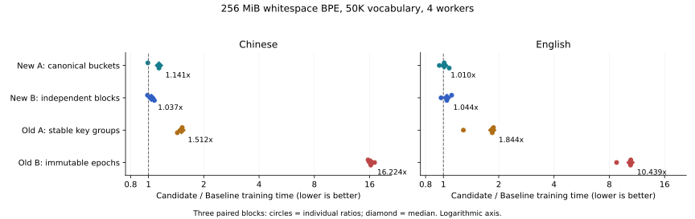

# Owner 四候选对照结果

2026-10-08（Asia/Shanghai）。中英文各约 256 MiB、普通 BPE／Whitespace、50K vocabulary、4 workers。四个候选均已独立实现、完成 release 构建后，与同一 Baseline 在一个共享批次测量。

**本轮保留 Baseline。四个候选都未显示明确的完整训练加速，按约定跳过单线程补测。** 新 bucket 方案的中文 paired 时间增加 14.1%、英文增加 1.0%；独立块方案分别增加 3.7% 和 4.4%。旧的稳定分组与 epoch 方案退化更大。此结论适用于下面两个负载和本机配置。

## 完整训练时间

时间为三个正式样本的独立中位数；括号中的变化率是同一 block 内 candidate／Baseline 比值的中位数，正值表示更慢。两种中位数口径可能不完全相等。Warmup 不参与排名。

| 实现 | 中文训练秒数（paired 变化） | 英文训练秒数（paired 变化） |
| --- | ---: | ---: |
| Baseline（fork main） | 7.0201 s | 0.8591 s |
| 旧 A：稳定 key 分组 | 10.6156 s（+51.22%） | 1.5331 s（+84.38%） |
| 旧 B：不可变 epoch | 116.1952 s（+1522.43%） | 8.6796 s（+943.88%） |
| 新 A：规范 bucket | 7.9448 s（+14.06%） | 0.8789 s（+1.01%） |
| 新 B：独立压缩块 | 7.3209 s（+3.72%） | 0.8981 s（+4.41%） |

图使用对数横轴；圆点为每轮比值，菱形为其中位数。下面的观察范围是三个实测比值的最小值与最大值，不能作为置信区间。

| 候选 | 中文三轮比值 | 英文三轮比值 |
| --- | --- | --- |
| 旧 A：稳定 key 分组 | 1.5268 / 1.5122 / 1.4358 | 1.8736 / 1.2845 / 1.8438 |
| 旧 B：不可变 epoch | 15.6778 / 17.0038 / 16.2243 | 10.4729 / 8.7635 / 10.4388 |
| 新 A：规范 bucket | 0.9921 / 1.1416 / 1.1406 | 1.0101 / 0.9501 / 1.0756 |
| 新 B：独立压缩块 | 0.9878 / 1.0372 / 1.0769 | 1.1088 / 0.9709 / 1.0441 |

补测门槛在运行前写入 README：某候选至少在一个语种的三轮 paired ratio 都小于 1，且 ratio 中位数不超过 0.95。没有候选满足，见 [t1-decision.json](evidence/t1-decision.json)。这是初筛门槛；本轮未做统计显著性检验，也未测 1 worker 的性能退化。

## CPU 与进程内存

CPU 秒数来自完整训练阶段的进程 CPU 时间；内存是输出序列化／验证前的进程 VmHWM，包含启动、prepared input 加载及训练。下表均为三个正式样本的中位数。VmHWM 并非 positions 载荷或精确分配字节；全程采样 RSS 及每轮内存记录也保留在证据中。

| 实现 | 中文 CPU 秒 | 中文 VmHWM MiB | 英文 CPU 秒 | 英文 VmHWM MiB |
| --- | ---: | ---: | ---: | ---: |
| Baseline（fork main） | 22.581 | 1453.27 | 2.506 | 148.18 |
| 旧 A：稳定 key 分组 | 30.563 | 1457.66 | 4.483 | 142.36 |
| 旧 B：不可变 epoch | 207.775 | 1479.91 | 16.265 | 129.72 |
| 新 A：规范 bucket | 24.556 | 1457.48 | 2.629 | 142.05 |
| 新 B：独立压缩块 | 23.362 | 1470.86 | 2.667 | 144.00 |

所有运行的采样 swap 峰值为 0，未触发内存、可用内存或超时 guard。英文 epoch 虽降低进程峰值内存，但训练耗时约为 Baseline 的 10.44 倍，本轮不选用。

## 四个实现与实际代价

四个 worktree 均从 fork main `8faaff79d859bfd6b2417cfe8c93ea2851c3aaca` 开始，未继承 Prezza 代码。完整 producer 已编码的 births 保持直接发布；active-ID reuse 使用原兼容路径。

- **旧 A／stable**：对完整 pair key 做稳定 radix 分组；key 任务检查有序删除、checked weighted count 和 floor 退休，聚合出生列表并协作编码，Owner 发布结果。超出 radix 原有限制的输入使用稳定排序兼容路径。
- **旧 B／epoch**：用不可变 Arc AVL epoch 表示新鲜 pair 状态。更新按 key 递归 split／join，未修改子树共享，join 后切换根。根维护精确 count／pair argmax，positions 通过只读 Arc handle 共享；每轮不平铺重建全部状态。
- **新 A／bucket**：按规范 rule／direction bucket 稳定汇集，复用 dense neighbor accumulator。聚合与编码任务按本轮工作量调度，单个热 key 也可沿长链检查点拆分。Owner 保留有序删除与状态／heap 发布。
- **新 B／blocks**：沿用 bucket 聚合，将至少 16,384 positions 的 residual 列表编码为独立压缩块。小片段合并为有界任务，join 后发布 ordinal 目录；cursor／seek／range 后续直接读块。

四个候选共同加入每 4096 positions 的生产阶段检查点：chain handle 从 12B 变为 16B，NeighborChanges 从 32B 变为 40B。stable、epoch、bucket 的大列表先并行计算编码长度，再直接写入唯一连续流中互不重叠的 byte／restart 区间，保留全局每 128 positions 的 restart 格式。blocks 改为每块独立 restart 和独立分配，额外目录及 16B allocation alignment 计入成本；SortedPositions handle 仍为 16B。

表中的对照包括这些共享元数据及各分支的全部变化。这里只根据完整训练决定去留，没有单独做阶段消融或采样，因此不能将时间差直接归因于某个容器、锁或指令。跨领域机制参照与源码入口见 [README.md](README.md)。

## 正确性与测量协议

所有 40 次进程运行成功：10 次 warmup、30 次正式测量，两个语种各 3 个完整 paired blocks；失败、取消、模型不匹配和被排除 block 均为 0。每次输出与该语种 Baseline 比较完整 vocabulary／token IDs 及 ordered merges，40 次全部相同。中文实际 50,000 tokens、32,241 merges；英文 50,000 tokens、44,917 merges，无 special tokens。

库测试数量为 bucket 104、stable 104、epoch 105、blocks 105，均通过；bucket／blocks 最后一次 complete-only bypass 改动还分别重跑了相关 97／98 个 BPE 测试。四分支 `clippy --all-targets --no-default-features -- -D warnings` 全部通过。新增覆盖包含 1／4 workers 下与原训练器对照完整 (pair, count, ID) trace 的 weighted／Unicode／hot-chain fixture、断点与复制分支、u64 position、127／128／129 restart 边界、错误与展开清理；epoch 额外检查随机 bulk 更新、持久快照和 AVL argmax，blocks 检查 seek／range／append／目录和释放。

大语料导出模型包含 IDs 和 merge 顺序，未逐轮导出 count trace；频率 trace 对照来自上述单元 fixture。测试结果和 SHA 见 [verification.json](evidence/verification.json) 及测试日志。

验证命令为 `cargo test --manifest-path tokenizers/tk-train/Cargo.toml --lib --no-default-features`；相关 BPE 复测在该命令后增加 `trainers::bpe` 过滤；Clippy 为 `cargo clippy --manifest-path tokenizers/tk-train/Cargo.toml --all-targets --no-default-features -- -D warnings`。

计时边界为公开 `do_train`：包含训练表示物化、初始索引、所有 merge、vocabulary 组装，截止序列化前。预分词和 prepared JSON 加载、输出序列化、模型验证均在计时外。每次独立进程；全部二进制先冻结，顺序执行该批次，正式计时期间没有并行编译或语料准备。五臂按 block 轮换顺序，每 case／arm 一次 warmup、三次正式样本。

本机为 KVM／Xeon Gold 6140 2.30GHz，6 vCPUs；训练固定 CPU 0–3 和 4 Rayon workers。Rust／Cargo 1.98.1，release opt-level 3、fat LTO、codegen-units 1、无自定义 RUSTFLAGS、无 default features；五臂使用同一 runner Cargo.lock 和 runner 源码。主机拓扑、load average、affinity、编译请求与依赖均在归档中；未记录的主机因素未用于解释差异。

## 固定输入与二进制

两份输入都是 pinned `wikimedia/wikipedia`（revision `b04c8d1ceb2f5cd4588862100d08de323dccfbaa`，20231101.zh／en）的 512 MiB 文本中取不超过 256 MiB 的完整行前缀。普通 Whitespace BPE，vocab size 50,000、min frequency 2，prefix／suffix／max length 均未设置。

| 语种 | 实际原始 bytes | 文本 SHA256 | prepared input ID |
| --- | ---: | --- | --- |
| zh | 268,435,162 | `61537f422d250f93ed669193faec992a516ce049b41ad33fb02b52064780ed98` | `70f85928c8daa1df13603569944a9e4fd4ef4146ba809075f892976c2552b42b` |
| en | 268,434,441 | `ae02a7e36df46e6dff26481f054dd4a385d50c4a42a9f166de754ee44fbf6b8a` | `a8345f69dc2b7af66450d1d4c61193949c96d2cd3e1b030aaf6314dc38e128ee` |

两个语种的 prepared JSON 分别为 250,116,097 和 10,900,666 bytes，来自相同的 raw-size 目标，但预分词后词项形状不同；本轮只在各语种内部比较候选。语料未随代码上传，完整取样、上游 shard SHA 和预处理 manifest 已归档。

下表是实际测量时的 code commit；分支后来追加报告／证据 commit，不改变已测源码。

| 实现 | 分支 | 已测 code commit | binary SHA256 |
| --- | --- | --- | --- |
| baseline | [main](https://github.com/Yikai-Liao/tokenizers/tree/main) | `8faaff79d859bfd6b2417cfe8c93ea2851c3aaca` | `070717e030355fb20d7ac13e9a39af744d94afd66179d2ffaa2ab8f7a3da2901` |
| stable | [experiment/owner-stable-group](https://github.com/Yikai-Liao/tokenizers/tree/experiment/owner-stable-group) | `e2e2f55e157beea06bdcba6e08190d8ecaba08fe` | `71c1278c66aa86c3982dcc2b3346b06fca00e078a643de126fbbb5f2cf8c65be` |
| epoch | [experiment/owner-epoch-index](https://github.com/Yikai-Liao/tokenizers/tree/experiment/owner-epoch-index) | `2d6c645a60faa4840a4d9609fba8e7952f0b6f0c` | `1611760bb0f649b6a502445c86199f2eae499886f91fbc38ff7a9ef1f42ff3b5` |
| bucket | [experiment/owner-independent](https://github.com/Yikai-Liao/tokenizers/tree/experiment/owner-independent) | `edbd4f70918b9bafea4c9f8f80858e1b49aeb566` | `d19cd30f48f67c59ea7dca073198518112b7ecb54ea54f863e9d740ee8a7c0dd` |
| blocks | [experiment/owner-block-positions](https://github.com/Yikai-Liao/tokenizers/tree/experiment/owner-block-positions) | `47fbe9b71ca0c3fa7a27366f90044d7d8dd6eac4` | `2da332552eb931a7dd751a1e2d3a9ae888ea001a88c755069c170ff263e078ee` |

## 证据与复现

[summary.json](evidence/summary.json) 与 [comparisons.csv](evidence/comparisons.csv) 保留全部原值和 paired 比值。[压缩证据](evidence/raw-metadata-and-models.tar.gz) 包含 spec／config／环境、五份 immutable build records、所有 attempt 的 job／result／stdout／stderr／memory、运行事件、两个规范化模型、输入 manifests 和本次 harness／runner 源码及 Cargo.lock。归档 SHA 与文件数量见 [archive.json](evidence/archive.json)。归档已在临时目录解压，使用所归档的 harness 从原始结果重建 summary，结果与发布的 summary 完全一致；归档与测试日志的 SHA 也已核验。

40 份模型逐一再次检查值相等后，按语种去重为两份参照；只排序 vocabulary 的拼写，不更改 token IDs 或 merge 顺序。原始 model 文件 SHA、规范模型 SHA 和参照路径见 [models.json](evidence/models.json)。原始语料和可重建的二进制不打包。

解压归档后可从 `harness` 目录用 `python3 -m bench build --source <对应仓库> --revision <上表 commit> --lockfile runner.lock --cache <构建缓存>` 重建对应 arm。按输入 manifests 恢复两份 prepared input 后，将五份 build.json 与两份 manifests 传给 [run.py](run.py)，默认运行本次 4-worker／3-block 矩阵；参数与证据导出见 README。原路径写在 raw config 中，异地复现需要替换路径。

本轮以 Baseline 作为当前选择，四个实验分支保留供复查；未合入 main。
