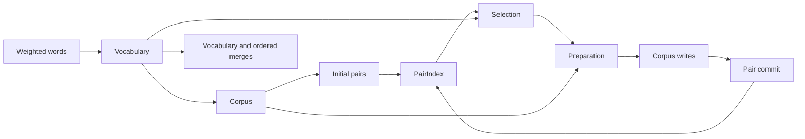

# BPE training

`BpeTrainer` builds a vocabulary and an ordered merge list from weighted words.
The builder, `Trainer::feed`, `Trainer::train`, and `train_vocab` are its public
entry points. WordPiece training consumes the vocabulary through `train_vocab`.
Thread selection uses `tk_encode::parallelism`.

The design keeps the optimized corpus, grouping, compression, and merge
algorithms behind readable ownership contracts. Storage mechanisms belong in
`tk-collections` so other tokenizer algorithms can reuse them. BPE identities,
weighted counts, candidate history, and phase ordering belong in the trainer.
Changing a collection layout must not require its callers to reproduce that
layout or its allocation rules.

## Ownership and phases



The coordinator in `engine/mod.rs` owns phase order. Each iteration selects rules,
resolves output IDs, prepares changes from an immutable corpus view, applies
joined writes, and commits pair changes. No preparation read overlaps corpus
writes. No next selection starts before commit completes.

| Module | Responsibility |
|---|---|
| `vocabulary` | Alphabet selection, decorated initial IDs, token strings, reserved IDs, and identity reuse |
| `corpus` | Token endpoints, immutable word boundaries, physical spans, and word weights |
| `initial_pairs` | Bounded record construction, stable grouping, initial counts, and position encoding |
| `pair_index` | Frequency interpretation, candidate priority, and historical position cohorts |
| `merge` | Disjoint merge plans and ordered neighbor changes |
| `aa_parity` | Leftmost nonoverlapping matches across position chunks |
| `execution` | One pool, worker scratch, and explicit scratch reuse |

`PreparedMerges` owns both the selected rules and their write positions. Its
consuming `apply` method returns `MergeEvents` after writes complete. Commit
borrows event chains until all count owners finish, then releases the complete
event buffers. Merge scratch is task-local; encoding scratch lives with the pool.

## Coordinates and storage

A position is a physical start slot, represented by `u64` throughout scheduling,
position storage, and event preparation. A resident allocation uses `usize`
indices. Full coordinate representation does not imply that a process can
allocate every possible coordinate.

The corpus stores token IDs in fixed `AtomicU32` slots. Live token IDs occupy
both endpoints of their physical span. Merges update endpoints without shifting
word suffixes. Immutable separators prevent matches across words.

A per-ID span table is sufficient while active IDs have one span. Before an ID
is reused for a different span, the corpus materializes per-occurrence spans.
Preparation then reads those spans; apply updates them after endpoint writes.

Initialization records cache a complete 64-bit pair key and a 32-bit wave-local
coordinate in twelve bytes. The key uses two `u32` fields to avoid alignment
padding. Adding the wave base restores the full-width global coordinate without
rereading the corpus. Stable grouping preserves position order within equal
keys. A wave contains at most `2^28` physical slots. All count owners sort
before installation starts. At most two owners install positions at once, and
each releases its raw record buffer before later owners allocate output.
Complete single-wave counts are filtered before one exact encoding per retained
key. Larger inputs build exact lists within each wave, then append those owned
lists into the accumulated table. They apply the global frequency floor after
accumulation.

Small position allocations use the same fixed size threshold throughout training;
larger buffers use the system allocator. Append reuses available capacity or
doubles its stream and restart capacities as needed. Replaced heap buffers free
immediately. Retired arena buffers leave with the complete training scope. No
separate construction arena or publication copy changes that lifetime.

`tk-collections` owns reusable storage mechanisms. It has no BPE identities,
word weights, candidate policies, or training pool.

| Collection | Contract |
|---|---|
| `SortedPositions` | Nondecreasing full-width coordinates, duplicates, range cursors, and append |
| `AllocationArena` | Small allocations live until the complete algorithm scope ends |
| `PositionBuffer` | Full-width coordinates with a shared high half until promotion |
| `PositionChains` | Bounded local links and full-width coordinates |
| `IdAccumulator` | A reusable ID directory with values allocated only for touched IDs |
| `IntervalIndex` | Values compressed over equal adjacent intervals; cursors support sequential queries |
| `radix` | Stable key grouping with bounded scratch |

`SortedPositions` writes an absolute seed for each group of at most 128 values
and varint gaps for the rest. A range cursor skips at most 127 gaps before its
first requested value. Independent cursors share immutable bytes. Small inline
lists need no allocation. Larger lists borrow an arena or own a heap allocation;
this choice remains internal. Builders consume one sorted run or reverse chain.
Construction uses reusable encoding scratch. Append measures a replayable run,
then writes directly beyond the published prefix without a suffix buffer. It
publishes the new length only after successful replay, so a producer error or
panic preserves the old list.

Position buffers and chain nodes share a private coordinate storage type. A
chain's low coordinate and local link occupy one item. A separate high plane
appears only when positions cross the shared high half.

Words are arranged by weight. The trainer retains the complete contiguous range
whose weight is one and checks that range before general interval queries.
Uniform initial weights multiply the occurrence count directly, and merge
preparation returns that constant weight without a lookup. Other initial groups
count equal-weight runs, and merge preparation uses a cached interval cursor
outside the unit-weight range.

## Identity and candidate history

Fresh identities cannot reuse active output IDs. Such rules can share a batch
when no selected output affects another selected input. The engine filters stale
positions and combines final neighbor changes. Counts below the frequency floor
can retire permanently. Sharded queues expose their leaders to a global selector;
only the observed winner is repaired against its current count.

Historical identities retain the mainline candidate semantics. The engine keeps
a signed ledger and a separate position cohort for each published birth event.
It selects one rule at a time. A stale position can still identify a word whose
current tokens now match after identity reuse. Words are deduplicated within a
cohort; distinct cohorts are never combined solely because their pair keys match.

Historical selection uses one global heap. Repairing shard heads eagerly would
change mainline ordering when a signed negative count converts to an unsigned
candidate priority. Preparation also preserves intermediate births followed by
removals within one word, including `AA -> A`. The strict maximum-length gate
applies to each birth; initial pairs retain the mainline initialization behavior.

Both identity policies share corpus navigation, weight lookup, event storage,
count routing, position encoding, and phase joins. The policy difference stays
in preparation and candidate ownership. Fresh frequencies use checked `u64`
arithmetic. Historical training requires word weights and total initial edge
mass to fit `i64`, so its signed ledger operations remain representable.

Commit receives the complete vocabulary ID domain from the coordinator.
Producers route nonzero removals and nonempty birth chains. A zero-weight birth
can still carry historical positions. Fresh job order and bucket ownership give
one sorted run with an already accumulated length, so encoding validates it in
one traversal. Historical sources retain the general chain-order check and
merge when left and right births interleave.

## Costs and validation

Let `N` be the physical corpus slots, including separators; `W` the words; and
`E` the initial pair occurrences. Let `C` count decoded candidate positions,
`S` count tokens visited by historical word scans, and `A` count corpus writes.
Let `H` count hash-table operations, `Q` count queue operations, and `K` be the
maximum queue size. Finally, let `M` be encoded position bytes and `G` be copied
bytes, including token strings and position-buffer growth.

Let `B` count input bytes and `L` count comparisons in interval and word-boundary
lookups. Corpus construction costs `O(B + W log W)`, including input scans and
word sorting. Stable radix grouping itself costs `O(E)` for fixed-width keys,
summed across waves. Weight accumulation also pays its lookup work. The remaining
work is `O(C + S + A + H + Q log K + M + G + L)`, with expected constant-time hash
lookups. An uncached interval query costs `O(log I)` for `I` intervals, and an
uncached word query costs `O(log W)`; cached sequential queries can avoid them.
These terms describe actual work; they do not assert linear training time.
Stale cohorts can increase `C`, historical identity reuse can increase `S`, and
lazy queue repair can increase `Q`.

The original Word-based trainer removes tokens from vectors and moves the
remaining suffix after each removal. A word of initial length `n` can therefore
require `O(n^2)` token moves across its merges. Endpoint updates cost constant
work per accepted match. Historical preparation can still scan affected words;
the endpoint layout removes suffix movement, not that semantic work.

On the supported 64-bit target, the main storage terms are:

| Component | Storage rule |
|---|---|
| Corpus IDs | `4N` bytes |
| Historical word boundaries | `8W` bytes; fresh training releases them after construction |
| Occurrence spans | `8N` bytes only when unequal-span identity reuse requires them |
| Initial records | `12E_wave` bytes, with `E_wave <= 2^28` |
| Installation groups | 24 bytes per vector capacity item, for at most two owners at once |
| Pair table | 32 bytes per raw bucket for the key, count, and position handle, plus hash-table controls |
| Fresh priorities | 16 bytes per queue capacity item |
| Historical candidates | 32 bytes per queue capacity item, including the position handle |
| Position chains | 8 bytes per node with a shared high half; promotion adds a 4-byte high plane |

Weight intervals, vocabulary strings, worker scratch, and allocator metadata
add separate terms. A G128 position stream uses eight bytes per absolute seed
and one to ten bytes per remaining gap. Each multi-group allocation adds an
eight-byte restart offset per group and its header. Inline lists need no stream
allocation. Append capacities can exceed used stream and directory lengths.

Peak RSS is the maximum simultaneous resident state. Raw owner records retire
as installation advances, so their complete total need not coexist with the
complete position output. Heap buffers free individually; the scope arena keeps
small retired buffers until training ends. Arena backing already includes its
position allocations and must not be added to their payload totals again.
Reserved scratch capacity, resident pages, and allocator retention are different
quantities. Compare snapshots from the same phase and report the unaccounted
residual instead of adding independent component maxima.

Tests retain the original Word-based algorithm as a test-only oracle. They
compare rule-by-rule choices and final vocabularies and merges. An independently
recomputing greedy oracle checks fresh training. Public feed, model training,
full JSON reload, affix behavior, and isolated public thread controls cover the
entry points. Collection tests cover full coordinates, duplicate positions,
restart ranges, chain ordering, allocation lifetime, and failed publication.

## Coarse ablation experiments

Future ablations substitute a leaf implementation through its existing contract
in an external benchmark source snapshot. Production keeps one implementation.
Each variant must preserve vocabulary IDs, ordered merges, affix settings, and
occurrence ownership.

| Group | Substitution and interpretation |
|---|---|
| Indexed corpus | Compare the complete engine with the untouched Word-based trainer; this is a whole-algorithm comparison |
| Initial grouping | Use reference grouping with the same full keys, coordinates, weights, and global frequency floor |
| Batch preparation | Select one certified rule per round and preserve ordered neighbor events |
| Weight locality | Keep the corpus arrangement and replace interval queries with scalar queries; assess arrangement and query locality together |
| Position compression | Use flat positions with the same occurrence and historical cohort semantics |
| Allocation and scratch reuse | Use ordinary owned allocations and job-local encoding scratch; include allocation and retirement costs |

Start with the full implementation, one group removed at a time, and the
mainline reference. This requires `O(k)` variants for `k` groups. Add an
interaction experiment only when evidence identifies coupling. Record complete
time, stage time, peak RSS, and exact model output from immutable binaries under
matched inputs. Instrumented diagnostic runs provide attribution separately from
formal timing runs.

## Thread scaling and progress

Thread scaling uses the existing public controls:

```rust
tk_encode::parallelism::set_num_threads(worker_count);
tk_encode::parallelism::set_parallelism(true);
```

Training reads the controls once on entry and creates one private pool.
Disabling parallelism selects one worker. Initialization and merging use this
same pool, including the one-worker case.

Run each scaling sample in a fresh process with `1, 2, 4, ...` workers up to the
CPU quota. Keep input, trainer settings, and output identical. Report
`speedup(n) = T(1) / T(n)`, `efficiency(n) = speedup(n) / n`, throughput, and peak
RSS. Measure feed and training separately, and use diagnostic runs for finer
phase costs. Record affinity and quota because pool width does not describe
physical CPU availability. A four-worker comparison alone is not a scaling
curve.

Progress uses the existing `Indicatif`, `JsonLines`, and `Silent` formats.
Enabled renderers read coarse completion counters every 250 milliseconds and
show stage elapsed time during long jobs. Heartbeats do not advance completed
work. Known stages use actual slots, records, or published keys and may show a
smoothed stage ETA after a complete sampling interval.

Merge progress reports learned rules and the current and target vocabulary
sizes. Frequency limits can stop early, and reused identities need not increase
vocabulary size. Remaining merge work therefore has no fixed total or ETA.
`Silent` and `show_progress(false)` create no renderer or stage counters. Token
loops perform no progress clocks or locks. Enabled progress overhead belongs in
its own representative benchmark comparison.

The radix translation preserves its BSD notice and attribution to
[Radsort](https://github.com/clausecker/radsort), revision
`f69e816c3cd79d312cd67aea5b9cf1c338c1b371`, and the
[original paper](https://arxiv.org/abs/2607.05302).
